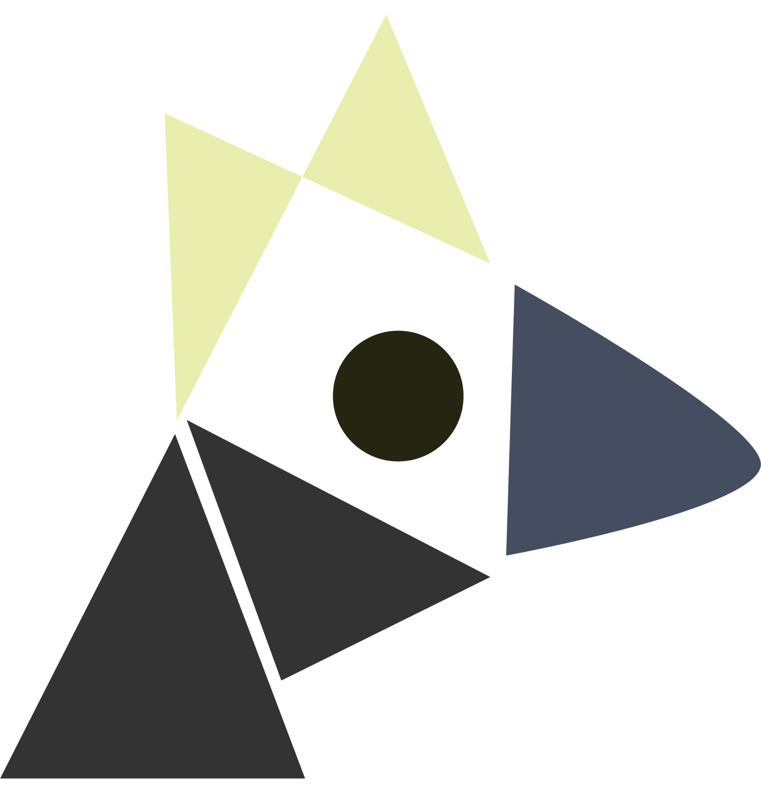

# hi, welcome to theseus

this is theseus. it makes GPUs and TPUs warm and fuzzy inside by harnessing the power neural architecture research™® on Human Languages℗. its fine. not too fast, not too good, but it does the thing and you can use it. to be clear, it gets about mid-20s MFU on a mid day and high-30s MFU on a good day, and it doesn't do anything fancy. i'm here to tell you how to use it, and i'd love to [know about it](mailto:hi@jemoka.com) if you ended up doing that.

## Installation

theseus is a template repo. You use it by having it. So, please, clone the repo:

```bash
git clone https://github.com/Jemoka/thx.git
cd thx
```

We use the [uv package manager](https://docs.astral.sh/uv/getting-started/), so make sure you have that. Now, depending on from whomst your computers must be warm, please choose your adventure:

- cuda13: `uv sync --group all --group cuda13`
- cuda12: `uv sync --group all --group cuda12`
- TPUs: `uv sync --group all --group tpu`
- CPU: `uv sync --group all --group cpu`

<!-- ## Running -->

<!-- You have two options: -->

<!-- 1. **Run theseus here**: [running experiments locally](docs/How-to/running-local.md) -->
<!-- 2. **Run theseus in chonky remote**:  [run on a remote cluster](docs/How-to/running-remote.md); just the `cpu` variant of theseus for your laptop is fine for that even if remote needs CUDA -->

## Start Quickly
We are going to invoke stuff that theseus already has built in, like tokenizing fineweb and training a GPT model. You refer to these by what's called *job keys*, like `data/tokenize/fineweb` and `gpt/train/pretrain`.

First, make a folder where things will go

```bash
mkdir /folder/where/things/go
```

Then, tokenize some data:


```python
from theseus.quick import quick

with quick("/folder/where/things/go") as q:
    q.build("data/tokenize/fineweb", "my-tokenize-job")
    job = q.create()
    job()
```

Finally, train a model:

```python
with quick("/folder/where/things/go") as q:
    q.build("gpt/train/pretrain", "my-training-job")

    # add salt (configurate) to taste
    # hint: q.config is an omegaconf, so you can print it
    q.config.training.per_device_batch_size = 8 # required! idk how much hbm u have

    # and then make it go brr
    job = q.create()
    job()
```

Your dataset job needs to share the same root folder as your training job. This is how theseus knows to load the dataset you've tokenized instead of blowing up and complaining you didn't have the dataset tokenized.

## What's next?
- Read the [docs](https://theseus.jemoka.com/quickstart).
- Read the 80% funnier [tutorial](https://theseus.jemoka.com/Tutorials/).
- Near bedtime? Read the [design](https://theseus.jemoka.com/Design).

## What's inside?
Code. It occasionally runs, and when it does you get features!

1. **models that go brrr**: mid-20s MFU on a mid day and high-30s MFU on a good day
2. **determinism** up to float: every step and every batch will be replayed exactly upon restoration
3. **time travel debugging**: because of ^ you can inspect, replay or recompute activations of *any layer, at any checkpoint, on any device, at any time* (or your money back)
4. **composition**: inheritance based module-level composition 
5. **sharding**: one-click FSDP, ZERO level 1, and Tensor Parallelism
6. **configurationing**: OmegaConf compatible configuration + discovery API with strict type resolution
7. **dispatch**: remote dispatch infrastructure and resource solving with support for SSH, SLURM, K8s Volcano, and GCP TPU hosts
8. **dataset and evaluations**: a buncha datasets already built-in, and adding one is just telling us how to manipulate strings and we'll make it embarrassingly parallel

...and probably more things I forgot. I'll try hard to at least have me or Codex write How-To guides covering each of these aspects, and link them here as they show up. 

<p align="center">
  
</p>
