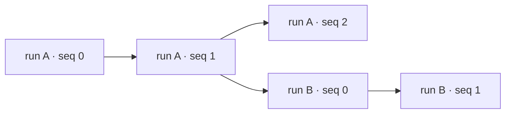

# Experiment DAG and Storage

???+ warning "Coming Soon"
    Heyoooo so I ran out of time writing docs as I have to do actual machine learning. I'll eventually catch this up but as of right now here's my friend `gpt-6-astra` who will do the talking.

---

An experiment produces several kinds of things at different times: training
metrics, checkpoints, evaluation scores, and perhaps a plot made days later.
theseus gives them a common address: a **node** in an experiment's lineage.
The node identifies the point being described. Parquet records describe that
point, and blob files hold the larger objects associated with it.

The DAG is this recorded lineage. It is distinct from the execution recipe
that tells the dispatcher which jobs to run. Dispatch can create branches and
resume existing nodes, but the stored graph describes what the jobs recorded.

## A node is an identity, not a row

A node's identity consists of three fields:

| Field | Meaning |
| --- | --- |
| `name` | The job's `project.group.run` name, defaulting to `general.default.<run>` when project and group are omitted. |
| `nonce` | A short generated identifier distinguishing lineages that use the same name. |
| `seq` | The integer position on that lineage's logical clock, starting at zero. |

`Node.serialize()` encodes those three fields into a URL-safe base64 string.
It is an address, not a content hash. Repeating a run name usually creates a
new nonce; two runs with identical settings are still separate runs.

A `Node` also carries an optional `parent`, expressed as another node's serialized
identity. The parent is not included in the child's identity. Deserializing an
address therefore recovers the name, nonce, and sequence, but does not fetch its
parents. `ObjectReader.parents(node)` reads the recorded direct parent edges.

Several writes may share exactly the same identity. A loss report, an evaluation
score, and a checkpoint marker can arrive in separate records and still describe
one logical node. Likewise, several JAX processes may record that node. They do
not create separate logical nodes merely by writing separate Parquet rows.

## Ticking creates a successor

`BasicJob.tick()` records the current node if the job has not already written it,
then advances the live node to its successor. The successor keeps the same name
and nonce, increments `seq`, and records the old identity as its parent.



The horizontal chains represent ticking. The edge from A's sequence 1 to B's
sequence 0 represents a new branch from that point. The new branch can have a
new run name, and gets a new nonce even if it reuses the old name.

Ticking mutates the existing live `Node` object through `Node.update()` instead
of replacing it. Dataloaders, profilers, and borrowed analyses can hold a
reference to that object and observe the same clock as the job.

A tick is not a filesystem flush, optimizer update, or checkpoint save. It only
advances the logical position after ensuring the old position has a record
queued. Job code decides which work belongs to each position. The standard
trainer performs its update, reports metrics, runs any scheduled evaluation or
analysis, and requests checkpointing before ticking.

The optimizer's `state.step` and the node's `seq` are consequently different
concepts. They need not be numerically equal: the first sequence is zero, a
branch starts a new sequence, and jobs other than trainers use the same node
abstraction. Use recorded token counts or optimizer metadata when that is the
quantity you intend to compare.

## Why the dataloader shares the clock

The training loader uses the node sequence to choose a deterministic batch plan.
Repeated `batch()` calls at the same node return the cached batch instead of
consuming more examples. This lets a debugger or analysis revisit the inputs
associated with the current training position. Advancing the node allows the
loader to advance its batch.

Restore initially selects the saved node. An analysis can inspect that position
without ticking. When the standard trainer actually resumes training at its
base node, it ticks once before consuming the next training batch, then continues
from the successor of the saved optimizer step.

Replay depends on keeping the relevant dataset, mixture, seed, and batching
configuration compatible. The identity alone does not preserve the entire input
pipeline. See [Dataloader I/O](dataloader-io.md) for the batch-plan and replay
invariants, and [interactive inspection](../Tutorials/inspecting-runs.md) for
using that behavior.

## Branching, resuming, and attaching work later

A job constructed with a base node restores state from that node. Its setup mode
determines the destination identity:

| Mode | Destination | Typical use |
| --- | --- | --- |
| No base | New lineage at sequence zero | A fresh experiment. |
| Branch from a base | New lineage at sequence zero, with the base as parent | Try a different training recipe or keep a separate analysis lineage. |
| Resume a base | The selected base identity itself | Continue training, or attach analysis to an existing checkpoint. |

Setup is idempotent: after successful setup, another setup call preserves the
prepared state and node. Normal job invocation synchronizes the node across
hosts so their writes refer to the same identity.

Historical analysis uses resume semantics deliberately. It restores a checkpoint,
replays the appropriate batch, and adds its artifact to that exact node without
advancing the clock. The plot's later write time and its historical node position
are both meaningful; attaching the plot does not pretend that the computation
occurred during the original training run.

Each individual record has at most one parent field, but records for one node
can contain different parent values. `parents()` returns their distinct union
rather than applying scalar conflict resolution to this graph relationship.
The normal tick/branch lifecycle creates forward lineage edges. The low-level
store does not perform general cycle detection, validate arbitrary parent
references, or merge model parameters when it sees multiple parents.

## The physical layout

With the default cluster directories, the object store looks like this:

```text
<root>/objects/
    values/
        part-<uuid>.parquet
        part-<uuid>.parquet
    blobs/
        <serialized-node>/
            nodespec.json
            config.yaml
            job.json
            rng.npy
            checkpoint/          # distributed checkpoint state
            attention.msgpack    # an optional analysis artifact
```

The blob contents depend on what was saved; not every node has a blob or a
checkpoint. `_x_blob` stores a relative path under `objects/blobs`, which readers
resolve against their object-store root. Analysis PDFs/JSON also have their
normal result files under the configured results directory.

`ObjectReader` only reads. `ObjectStore` adds the scalar writer and blob-directory
interface. `RecordStore` adds lightweight MessagePack payloads for artifacts.
Model checkpoints use `CheckpointedJob` and the Orbax-backed checkpoint manager,
not the MessagePack artifact path.

This separation also allows a reader to use a local mirror of Parquet parts
while resolving blob paths against the original object store. Sharing or
mirroring metadata does not implicitly copy checkpoint contents. See
[JuiceFS Integration](../How-to/remote-configuration/juicefs.md) for a shared-root deployment.

## Publishing Parquet parts

A call to `value(node, fields)` copies scalar fields into a queue and adds the
node identity, parent, process index, execution/tag information, and write order.
Keys beginning with `_x_` are reserved metadata. Large arrays and figures belong
in checkpoints or artifacts rather than scalar columns.

Each store has a background writer. It batches up to 4,096 queued rows or flushes
on a 30-second deadline. Closing the store drains the queue. Each batch's schema
is the union of its keys, with nulls where an individual row lacks a field; later
parts can introduce new metric columns.

The writer claims a unique hidden temporary filename, writes a complete Parquet
table, then renames it to `part-<uuid>.parquet`. Readers query the final
`*.parquet` files, so an unfinished temporary file is not queryable. A successful
queue operation is therefore not an immediate durable write or a guarantee that
a concurrent reader can already see it.

Closing also compacts parts owned by that store instance. It unifies their
schemas and copies the rows into a replacement part before deleting the source
parts. It does not rewrite another writer's parts or fold logical nodes during
compaction. Interruption after publication can leave duplicate rows; deleting
inputs only after publication avoids removing the only copy first.

This is file publication, not a database transaction covering every part and
blob. A crash can lose queued records. Writer failures are surfaced on later
writes or close; the current retry loop covers temporary-file claim permission
errors with waits of 1, 2, 4, and 8 seconds. It does not make permanent permission
failures harmless or retry every storage operation.

## ClickHouse is the query engine

theseus calls embedded ClickHouse through `chdb` to query the Parquet files and
return Arrow tables. This storage path does not require a separate ClickHouse
server or insert rows into a server-managed table. The durable scalar data is
in the Parquet directory.

Queries infer a union schema across parts and group by
`(_x_name, _x_nonce, _x_seq)`. For every requested field, an `argMaxIf` aggregate
chooses the highest-priority non-null value. Nonconflicting fields accumulate;
a later sparse record does not erase keys it omits.

For example, these physical records all target the same node:

| Process | Write order | `train/loss` | `eval/accuracy` |
| --- | --- | --- | --- |
| 0 | Earlier | 2.4 | — |
| 1 | Later | 9.0 | 0.6 |
| 0 | Latest | 2.1 | — |

The logical result contains `train/loss=2.1` and `eval/accuracy=0.6`. Process zero
wins the loss conflict; process one's accuracy still contributes because process
zero did not supply that field.

Priority is lexicographic: lower process index first, then the explicit write
order when present, with file time, filename, and row position as fallbacks and
tie-breakers. The writer makes its timestamp-derived order monotonic within the
store instance. This is a defined conflict policy, not an average across replicas
or a globally synchronized distributed clock. Distributed metric reduction must
happen before logging if an average is what you need.

The wide-schema query uses `COLUMNS(...) APPLY(...)` to express the same aggregate
for many fields without repeating its full SQL text for every field. It still
names the selected columns and still folds them; a raw `SELECT *` would return
physical fragments instead of logical nodes. The parser's `max_query_size` is
set before parsing the generated SELECT, and expression-derived output names
are mapped back to the public field names.

## Filtering and selecting logical nodes

Identity and execution-scope filters restrict the physical input. Value predicates
such as `.where("train/loss", "<=", 2.5)` are applied to the grouped result, so
they use the same resolved field value that selection returns. Checkpoint and
artifact filters test whether the group contains their respective markers.

`.all()` returns node identities. `.select()` returns folded values;
`.select(return_nodes=True)` pairs each row with its identity. `keys=[...]` limits
the returned fields, while `keys=None` returns all available user fields.
Reserved `_x_` fields require `raw=True`; `blob` is exposed as a resolved path.
If a requested field is absent from the entire available schema, the current
query returns no rows. A missing value within one node is omitted from that
node's returned mapping.

`latest()` means most recently written among the matching groups, with sequence
and identity tie-breakers. It does not simply mean the largest training sequence.
Adding an artifact to an old checkpoint can make that node the most recently
written one. Sort explicitly by sequence when sequence order is your intent.
Query execution clears accumulated filters and predicates; use a fresh builder
for a separate question.

## Interpolation belongs to the view

Folding combines records with the **same identity**. It does not fill missing
measurements from neighboring sequences, follow a parent to inherit metrics, or
interpolate between checkpoints. A store query only returns recorded values.

The UI can interpolate when positioning a cursor or a checkpoint marker on a
plotted series. Its interpolation is linear between neighboring points and
clamps to endpoint values outside their range. For a custom x-axis, it can first
map a checkpoint's sequence to an x-coordinate, then find a y-coordinate on the
curve. Smoothing and plot downsampling are also presentation operations.

Those displayed coordinates are not new stored measurements. Selecting a node
for restoration still selects an actual recorded identity and its actual blob;
an interpolated point is not an interpolated model checkpoint.

## Checkpoint and artifact completion are separate

A checkpoint blob contains model state, saved configuration, job metadata, and
random-state information. Its scalar record carries `_x_checkpoint`. Orbax saves
are asynchronous: the manager waits for a previous save before starting another,
and closing waits for outstanding saves. Publishing a blob's metadata does not
by itself prove every asynchronous checkpoint file is already complete.

Artifacts use a separate process-zero worker to serialize MessagePack, replace
the payload file, and publish a blob/record marker. Reusing an artifact suffix at
the same node replaces that payload. Scalar history is append-oriented, but
blob files are not immutable versions of every previous write.

The useful boundary is the logical node: it ties state, observations, and lineage
together while allowing their storage and computation to proceed independently.
For the concrete APIs, see [Analysis System](../How-to/analysis.md),
[Evaluation System](../How-to/evaluation.md), and
[the training tutorial](../Tutorials/running.md). The implementation lives in
`theseus/base/dag.py`, `theseus/job.py`, `theseus/store.py`, and
`theseus/checkpoint.py`.
